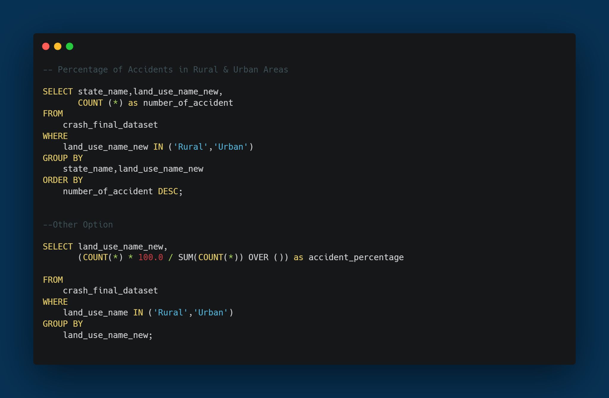
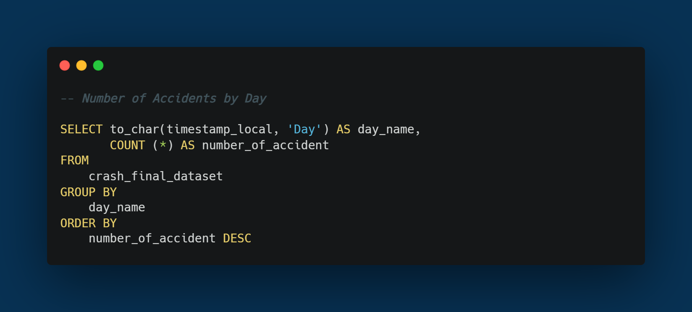

# NHTSA Roadsafe

## Introduction

This project is centered around the analysis of the National Highway Traffic Safety Administration (NHTSA) crash data, aiming to contribute valuable insights for the reduction of highway crashes in the United States. Employing Power BI and SQL, the project focuses on extracting, cleaning, and visualizing data to offer pertinent recommendations to NHTSA for the formulation of new regulations.

## Problem Statement
Reducing the number of highway crashes is a paramount goal for the National Highway Traffic Safety Administration (NHTSA). To contribute to this objective, the project focuses on analyzing and visualizing NHTSA crash data to identify key patterns, risk factors, and geographical trends. The insights derived from the analysis aim to provide actionable recommendations for the formulation of effective regulations, ultimately contributing to a significant reduction in highway accidents.

### Problem Researched

1. **Top 10 States with the Most Accidents:**
   - Identify and analyze the states where the highest number of accidents occur.

2. **Percentage of Accidents Caused by Drunk Drivers:**
   - Investigate the proportion of accidents attributed to drivers under the influence of alcohol.

3. **Percentage of Accidents in Rural and Urban Areas:**
   - Explore the distribution of accidents in rural and urban settings.

4. **Number of Accidents by Day:**
   - Analyze the frequency of accidents based on the day of the week.

5. **Number of Accidents by Month:**
   - Examine the seasonal variations in the occurrence of accidents.

6. **Hour with the Most Accidents:**
   - Identify the specific hour of the day with the highest number of accidents.

## Skill Demonstrated

- **Data Analysis:** Utilized SQL for data cleaning and transformation to ensure dataset integrity.
- **Visualization:** Created an intuitive Power BI dashboard for insightful data visualization.
- **Time-Zone Adjustment:** Implemented time-zone adjustments based on state information.
- **Insight Translation:** Translated complex data into actionable insights for informed decision-making.

## Data Sourcing

The dataset was sourced from refocus, providing a comprehensive collection of NHTSA crash data, forming the foundation for in-depth analysis.

## Data Transformation

Utilizing SQL, the data underwent rigorous cleaning and transformation processes, ensuring the dataset's integrity and relevance for analysis. Notably, a time-zone adjustment mechanism was implemented based on state information.

### The SQL query I use for data cleansing and data validation

### Query Explanation

| Before Data Cleaning & Validation | After Data Cleaning & Validation |
|----------|----------|
|  |  |

### _Additional information: For example you can see the changes in the timestamp column_

### Write SQL Queries in each case

| Top 10 States with the Most Accidents                                           |                               Result |
|---------------------------------------------------------------------------------|-------------------------------------------------------------------------------|
|                                                             |                                                    |
| Percentage of Accidents Caused by Drunk Drivers                                |                                |
|                                                              |                                                             |
| Percentage of Accidents in Rural and Urban Areas                                |                                |
|                                                              |                                                             |
| Number of Accidents by Day                               |                                |
|                                                              |                                                             |
| Number of Accidents by Month                                |                                |
|                                                              |                                                             |
| Hour with the Most Accidents                               |                                |
|                                                              |                                                             |

### _Additional information: This project initially used sql as data cleaning and validation, while for visualization using Excel/spreadsheets. Then I upgraded when I was able to Power BI with a few changes._
_for visualization in excel/spreadsheets you can see here[Spreadsheets](https://docs.google.com/spreadsheets/d/1HdKMd7dC9lPaufdaAg1IZ66tBdSbk8cIbod_ibwFRbI/edit#gid=1227326390)_

## Modeling

The project involves the creation of a robust Power BI dashboard to facilitate comprehensive modeling and analysis of the NHTSA crash data. Although there are no established relationships between tables, the dataset is structured for straightforward analysis.

- Hide columns that are not used in the analysis

- Dax that I used in this project

  Create Measure 

  Create New Column 

## Analyze & Visualization

The analysis spans various dimensions, including accident trends, risk factors, and geographical patterns. The Power BI dashboard serves as a powerful tool for visualizing key insights derived from the NHTSA crash data.

### Some of the things in the dashboard :
- Filter Function
- Buttons
- Interactive Dashboard
- Add illustrations for better understanding

### You can interact with Report Here _[Novypro](https://www.novypro.com/project/nhtsa-roadsafe)_

## Conclusion & Recommendation

In conclusion, the analysis of the NHTSA crash data is poised to provide valuable insights that can significantly contribute to NHTSA's goal of reducing highway crashes.Among them are :

- The 10 states with the highest number of accidents are Texas, California, Florida, Georgia, North Carolina, Ohio, Illinois, Tennessee, Pennsylvania, and Michigan. 
- The data indicates that 25% of accidents are caused by drunk drivers, while 74% are attributed to sober drivers.
- Data shows that accidents that occur in urban areas are higher, namely 57% with 20101 accidents.Then for accidents that occurred in Rural (Rural) namely 42% with 14829 accidents.
- The highest number of accidents occurred on the day.week with a total of 6341 accidents, while the number of accidents,the lowest occurred on Tuesday with a total of 4345 accidents.
- In April, there were 2,104 accidents, the lowest, while October had the highest at 3,517 accidents. Months with over 3,000 accidents are June, July, August, September, October, and November, 
  indicating a trend of increasing accidents in the second half of the year.
- Accidents often occur between 5 a.m. and 8 p.m., with the peak occurring during the day at 1 p.m. 

The recommendations derived from the findings will inform policymakers, law enforcement, and relevant authorities, fostering the development of targeted interventions to improve road safety.Among Them are :

- States with high accident rates such as Texas, California, Florida need to improve traffic monitoring and surveillance,because there will be more than 3000 cases of accidents.
- Create an alcohol detection system or device on vehicles and Give warnings, warnings and legal sanctions if there are drunk drivers.
- Launch a unified awareness program for both rural and urban areas. Focus on traffic rules, driving safety, and anti-drunk driving in villages. Enhance urban road infrastructure and enforce 
  strict measures like traffic lights and speed limits for improved overall road safety.
- Weekends, particularly Sundays and Saturdays, have the highest accident rates. Increase patrols and law enforcement on these days, focusing on highways. Enhance surveillance to discipline - 
  drivers for overspeeding, disregarding traffic lights, drunk driving, and other risky behaviors.
- Elevate road safety awareness, especially in the second half of the year with higher accident rates. Intensify campaigns, strengthen traffic enforcement, and increase police patrols for a 
  concerted effort to reduce accidents.
- Increase police surveillance and patrols in the time frame from 5am to 8pm. This can help prevent traffic violations and reduce accidents.

---------------------------------------------------------------------------------------------------------------------------------------------------------------------------------------------------
